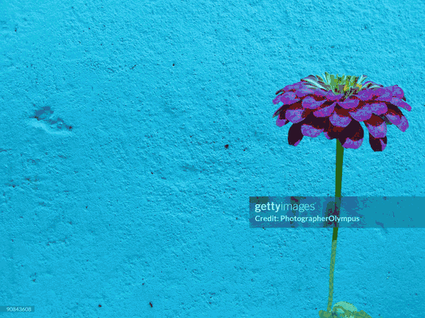

# Prisma (`psm`)

## Description

**Prisma (`psm`)** is a modern C++20 library for color space conversions with
support for professional graphics and photography workflows.

## Supported Color Spaces

Prisma supports conversion between the following color spaces, each implemented
as an independent module:

- **sRGB** - Core reference color space
- **Adobe RGB** (`psm::adobe_rgb`) - Professional print color space
- **DISPLAY-P3** (`psm::display_p3`) - Wide gamut color space for modern
  displays
- **oRGB** (`psm::orgb`) - Perceptually uniform color space with three channels:
  - L - Luminance
  - Cyb - Chromatic Yellow-blue
  - Crg - Chromatic Red-Green Adjusting these channels allows fine control over
    warm-cool tones in images
- **ProPhotoRGB** (`psm::pro_photo_rgb`) - Wide gamut color space for
  photography

## Features

- **Accurate Color Space Conversion**: All conversions maintain color accuracy
  through proper intermediate transformations
- **Channel Adjustment** (`psm::adjust_channels`): Allows percentage-based
  adjustment of individual color channels
- **C++20 Compatibility**: Built with modern C++20 features
- **Modular Architecture**: Each color space is implemented as a separate module
  that can be included or excluded as needed
- **Simple API**: Single header inclusion (`#include "psm/psm.hpp"`) provides
  access to all available color spaces
- **Container Flexibility**: Works with any container that satisfies
  `std::ranges::contiguous_range`
- **Command-line Tool**: Includes a CLI utility for image processing

## Supported Containers

The library is compatible with various container types including:

- `std::vector`
- `std::array`
- `std::span`
- Custom allocator containers
- Const containers

Any container that satisfies the `std::ranges::contiguous_range` concept is
supported.

## Limitations

- Additional channels (like alpha) are not supported during conversion

## Test Status

[](https://github.com/neg-c/psm/actions/workflows/run-tests.yml)

## Error Handling

The library uses exceptions for error handling:

- `std::invalid_argument` is thrown if input buffer size is not a multiple of 3
- `std::invalid_argument` is thrown if output buffer size doesn't match input
  buffer size

## Getting Started

Follow the instructions in the [INSTALL](INSTALL.md) file to build and integrate
Prisma into your project.

## Usage Example

Here's a simple example showing color space conversion from sRGB to Adobe RGB,
channel adjustments, and conversion back to sRGB for display:

```cpp
#include "psm/psm.hpp"  // Single header for all color space functionality

int main() {
    // Input data in BGR format
    const std::vector<unsigned char> input_image = {
        0,   0,   255,  // Red pixel (B=0, G=0, R=255)
        0,   255, 0,    // Green pixel (B=0, G=255, R=0)
        255, 0,   0     // Blue pixel (B=255, G=0, R=0)
    };

    // Create output buffer
    std::vector<unsigned char> adobe_rgb_image(input_image.size());
    std::vector<unsigned char> orgb_image(input_image.size());
    std::vector<unsigned char> output_image(input_image.size());

    // Convert between any supported color spaces
    psm::Convert<psm::sRGB, psm::AdobeRGB>(input_image, adobe_rgb_image);

    // Adjust channels in any color space (AdobeRGB in this case)
    // Adjust the individual channels
    psm::Percent adjustments{20, -10, 0};  // +20% blue, -10% green, 0% red
    psm::AdjustChannels(adobe_rgb_image, adjustments);

    // Convert through oRGB and back to sRGB
    psm::Convert<psm::AdobeRGB, psm::oRGB>(adobe_rgb_image, orgb_image);
    psm::Convert<psm::oRGB, psm::sRGB>(orgb_image, output_image);
}
```

## Visual Examples

### Color Space Conversions

Below are visual examples of the same image converted to different color spaces.
Note how each color space captures different color characteristics:

 _Left to
right: Original sRGB, Adobe RGB, Display-P3, and ProPhoto RGB conversions_

The gamut differences are particularly noticeable in saturated colors, where
wider gamut spaces like ProPhoto RGB preserve details in highly saturated
regions.

### Channel Adjustments

The following GIF demonstrates the effect of adjusting different channels in the
oRGB color space:

 _Adjusting Cyb
(yellow-blue) and Crg (red-green) channels in oRGB space_

This visualization shows how oRGB's perceptually uniform channels allow for
precise control over color temperature and tonal balance without affecting
luminance.

## Command-line Tool

Prisma includes a command-line tool (`psm_cli`) for image processing, color
space conversion, and channel adjustment:

### Features

- Convert images between any supported color space
- Adjust RGB channels by percentage values
- Process and save images in JPEG format

### Channel Adjustment Notes

When adjusting channels, the effect varies by color space:

- In RGB-based spaces (sRGB, AdobeRGB, DisplayP3, ProPhotoRGB), values adjust
  the Red, Green, and Blue channels
- In oRGB space, channel adjustments work on:
  - Channel 0: Luminance - Overall brightness
  - Channel 1: Cyb - Yellow-blue axis (positive values add yellow tones,
    negative values add blue tones)
  - Channel 2: Crg - Red-green axis (positive values add red tones, negative
    values add green tones)

This makes oRGB particularly useful for adjusting the warm-cool balance of an
image while preserving perceptual uniformity.

### Usage

```bash
# Convert an image from sRGB to AdobeRGB
psm_cli -i input.jpg -o output.jpg -f sRGB -t AdobeRGB

# Convert an image and adjust channels (increase red by 10%, leave green unchanged, decrease blue by 5%)
psm_cli -i input.jpg -o output.jpg -f sRGB -t DisplayP3 -a 10,0,-5

# Help
psm_cli --help
```

### Options

```
-i, --input FILE       Input image file
-o, --output FILE      Output image file
-f, --from COLORSPACE  Source color space (sRGB, AdobeRGB, DisplayP3, oRGB, ProPhotoRGB)
-t, --to COLORSPACE    Target color space (sRGB, AdobeRGB, DisplayP3, oRGB, ProPhotoRGB)
-a, --adjust R,G,B     Adjust channels by percent (e.g., 10,5,-5)
-h, --help             Show this help message
```

## Integration with CMake

Add Prisma (`psm`) to your CMake project:

```cmake
find_package(psm REQUIRED)

# Link core functionality
target_link_libraries(<your_target> PRIVATE psm::psm)

# Optionally link specific color space modules if you dont want the whole library
target_link_libraries(<your_target> PRIVATE
    psm::orgb          # Link oRGB support
    psm::adobe_rgb     # Link Adobe RGB support
)
```

Note: Regardless of which modules you link against, you always include the same
header (`psm/psm.hpp`). The library automatically enables/disables color spaces
based on what modules were built and linked.

## License

Prisma is licensed under the MIT License. See [LICENSE](LICENSE) for details.
